# EKS Production Project

## Overview

This project demonstrates the deployment of a resilient, scalable, and observable Python web application on Amazon EKS (Elastic Kubernetes Service) across multiple AWS regions (`us-east-1` and `us-west-2`). It utilizes Infrastructure as Code (IaC) with Terraform and Terragrunt for managing AWS infrastructure and employs GitOps practices via Argo CD for deploying Kubernetes applications and services.

The setup includes:
*   Multi-region EKS clusters.
*   VPC networking with public/private subnets per region.
*   Managed Node Groups and Karpenter for efficient node management and autoscaling.
*   A sample Python (Flask) application.
*   Databases and logging services (MySQL, Elasticsearch, Fluentd).
*   A comprehensive monitoring stack (Prometheus, Grafana, Alertmanager).
*   Security tooling (Trivy Operator, Polaris, Network Policies).
*   Event-driven application autoscaling (KEDA).
*   Secure secrets management (AWS Secrets Manager, External Secrets Operator).
*   Automated DNS and Load Balancing (ExternalDNS, AWS Load Balancer Controller).
*   CI/CD pipeline using GitHub Actions for container image builds.

## Goal

The primary goal is to provide a robust and production-ready template for deploying applications on EKS, emphasizing best practices for:
*   **Infrastructure as Code:** Repeatable and version-controlled infrastructure.
*   **GitOps:** Declarative application and configuration management.
*   **Multi-Region Deployment:** High availability and regional isolation.
*   **Observability:** Integrated monitoring, logging, and alerting.
*   **Scalability & Resilience:** Automated node and application scaling.
*   **Security:** Secure secrets handling, network policies, and vulnerability scanning.

## Architecture

```mermaid
flowchart TB
    GH["GitHub Repository"] --> GHA["GitHub Actions<br>CI/CD Pipeline"] & TERRAFORM["Terraform/Terragrunt<br>IaC"]
    GHA --> ECR_EAST["ECR Repository<br>us-east-1"] & ECR_WEST["ECR Repository<br>us-west-2"] & GH
    VPC_EAST["VPC (10.10.0.0/16)"] --- IGW_EAST["Internet Gateway"] & NAT_EAST["NAT Gateways"] & SUBNETS_EAST["Public & Private Subnets"]
    CP_EAST["EKS Control Plane<br>v1.29"] --- MNG_EAST["Management<br>Node Group"] & SNG_EAST["Services<br>Node Group"] & DNG_EAST["Data<br>Node Group"] & MON_NG_EAST["Monitoring<br>Node Group"]
    MNG_EAST --- ARGO_EAST["ArgoCD"] & AWS_LB_EAST["AWS Load Balancer<br>Controller"] & EXTERNAL_DNS_EAST["External DNS"] & EXT_SECRETS_EAST["External Secrets<br>Operator"] & KARPENTER_EAST["Karpenter"] & KEDA_EAST["KEDA"] & NET_POL_EAST["Network Policies"] & TRIVY_EAST["Trivy Operator"] & POLARIS_EAST["Polaris"]
    SNG_EAST --- PYTHON_APP_EAST["Python Web App<br>Deployment"] & APP_HPA_EAST["HPA/KEDA<br>ScaledObject"] & APP_SVC_EAST["App Service<br>(ClusterIP)"] & APP_ING_EAST["App Ingress<br>(ALB)"]
    DNG_EAST --- MYSQL_EAST["MySQL<br>StatefulSet"] & ES_EAST["Elasticsearch<br>StatefulSet"] & FLUENTD_EAST["Fluentd<br>DaemonSet"]
    MYSQL_EAST --- MYSQL_PVC_EAST["MySQL PVC<br>EBS Volume"] & MYSQL_SVC_EAST["MySQL Service<br>(ClusterIP)"]
    ES_EAST --- ES_PVC_EAST["ES PVC<br>EBS Volumes"] & ES_SVC_EAST["ES Service<br>(ClusterIP)"]
    FLUENTD_EAST --> ES_SVC_EAST
    MON_NG_EAST --- PROM_EAST["Prometheus"] & GRAFANA_EAST["Grafana"] & ALERTMANAGER_EAST["Alertmanager"] & MYSQL_EXP_EAST["MySQL Exporter"] & ES_EXP_EAST["Elasticsearch<br>Exporter"]
    ARGO_EAST --> PYTHON_APP_EAST & MYSQL_EAST & ES_EAST & PROM_EAST
    PYTHON_APP_EAST --> MYSQL_SVC_EAST & ES_SVC_EAST
    KEDA_EAST --> APP_HPA_EAST
    KARPENTER_EAST --> SNG_EAST
    EXT_SECRETS_EAST --> SM_EAST["Secrets Manager"]
    EXTERNAL_DNS_EAST --> R53_EAST["Route 53<br>blizzard.co.il"]
    AWS_LB_EAST --> APP_ING_EAST
    APP_ING_EAST --> IGW_EAST
    APP_ING_EAST --- ACM_EAST["ACM Certificate<br>*.blizzard.co.il"]
    ECR_EAST --> PYTHON_APP_EAST
    R53_EAST --> APP_ING_EAST
    CP_WEST["EKS Control Plane<br>v1.29"] --- NODES_WEST["Node Groups"]
    NODES_WEST --- SERVICES_WEST["Cluster Services"] & APP_WEST["Python Web App"]
    ECR_WEST --> APP_WEST
    R53_GLOBAL["Global Route 53<br>blizzard.co.il"] --> R53_EAST & R53_WEST["R53_WEST"]
    TERRAFORM --> VPC_EAST & VPC_WEST["VPC (10.20.0.0/16)"]
    KMS_EAST["KMS Keys"]
    CW_EAST["CloudWatch Logs"]

    GH:::cicd
    GHA:::cicd
    ECR_EAST:::aws
    ECR_WEST:::aws
    VPC_EAST:::vpc
    IGW_EAST:::vpc
    NAT_EAST:::vpc
    SUBNETS_EAST:::vpc
    R53_EAST:::aws
    ACM_EAST:::aws
    CP_EAST:::eks
    MNG_EAST:::k8s
    SNG_EAST:::k8s
    DNG_EAST:::k8s
    MON_NG_EAST:::k8s
    ARGO_EAST:::argo
    AWS_LB_EAST:::k8s
    EXTERNAL_DNS_EAST:::k8s
    EXT_SECRETS_EAST:::security
    KARPENTER_EAST:::k8s
    KEDA_EAST:::k8s
    PYTHON_APP_EAST:::service
    APP_HPA_EAST:::k8s
    APP_SVC_EAST:::service
    APP_ING_EAST:::service
    MYSQL_EAST:::db
    MYSQL_SVC_EAST:::db
    ES_EAST:::elastic
    ES_SVC_EAST:::elastic
    FLUENTD_EAST:::service
    PROM_EAST:::monitoring
    GRAFANA_EAST:::monitoring
    ALERTMANAGER_EAST:::monitoring
    MYSQL_EXP_EAST:::monitoring
    ES_EXP_EAST:::monitoring
    NET_POL_EAST:::security
    TRIVY_EAST:::security
    POLARIS_EAST:::security
    KMS_EAST:::aws
    SM_EAST:::security
    CW_EAST:::aws
    VPC_WEST:::vpc
    CP_WEST:::eks
    NODES_WEST:::k8s
    SERVICES_WEST:::service
    APP_WEST:::service
    R53_GLOBAL:::aws
    TERRAFORM:::cicd
    R53_WEST:::aws
    classDef aws fill:#FF9900,stroke:#232F3E,color:#232F3E
    classDef eks fill:#FF9900,stroke:#232F3E,color:#232F3E,stroke-width:2px
    classDef k8s fill:#326CE5,stroke:#326CE5,color:white
    classDef argo fill:#EF7B4D,stroke:#EF7B4D,color:white
    classDef db fill:#3C873A,stroke:#3C873A,color:white
    classDef elastic fill:#005571,stroke:#005571,color:white
    classDef monitoring fill:#E6522C,stroke:#E6522C,color:white
    classDef security fill:#D82C20,stroke:#D82C20,color:white
    classDef cicd fill:#2496ED,stroke:#2496ED,color:white
    classDef vpc fill:#248F73,stroke:#248F73,color:white
    classDef service fill:#6BA539,stroke:#6BA539,color:white
```

## Core Technologies

*   **Cloud Provider:** AWS (EKS, VPC, EC2, ALB, Route 53, S3, Secrets Manager, KMS, IAM, ECR)
*   **IaC:** Terraform, Terragrunt
*   **Container Orchestration:** Kubernetes (Amazon EKS)
*   **GitOps:** Argo CD
*   **CI/CD:** GitHub Actions
*   **Packaging:** Helm, Docker
*   **Monitoring:** Prometheus, Grafana, Alertmanager
*   **Logging:** Elasticsearch, Fluentd
*   **Security:** Trivy Operator, Polaris, Network Policies, AWS IAM/IRSA, External Secrets Operator
*   **Autoscaling:** Karpenter (Nodes), KEDA (Application)
*   **Networking:** AWS Load Balancer Controller, ExternalDNS
*   **Application:** Python (Flask)

## 💸💸💸 Cost Warning 💸💸💸

**Deploying this project will provision a significant amount of AWS resources in *each* target region (`us-east-1` and `us-west-2`), incurring potentially substantial costs.**

*   **Rough Daily Estimate:** **$70 - $100+ USD** (across both regions)
*   **Rough Monthly Estimate:** **$2100 - $3000+ USD** (across both regions)

Actual costs depend heavily on usage, scaling, data transfer, and regional pricing. **Use the AWS Pricing Calculator and monitor your costs closely.**

**Remember to destroy the infrastructure in *both regions* using `terragrunt run-all destroy` when not actively using it to avoid ongoing charges.**

## Technical Documentation

Detailed information about the specific modules and configurations can be found here:

*   **Terraform Modules:** [`docs/terraform.md`](./docs/terraform.md)
*   **Argo CD ApplicationSets & Helm Charts:** [`docs/argocd_modules.md`](./docs/argocd_modules.md)

## Deployment Instructions

For prerequisites, step-by-step deployment instructions, and validation checks, please refer to the comprehensive deployment guide:

*   **Deployment Guide:** [`docs/DEPLOYMENT.md`](./docs/DEPLOYMENT.md)

## Cleanup

To completely remove all resources created by this project and avoid ongoing AWS charges, follow the detailed instructions in the cleanup guide:

*   **Cleanup Guide:** [`docs/CLEANUP.md`](./docs/CLEANUP.md)